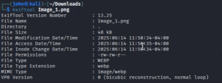
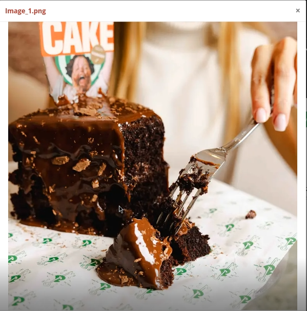
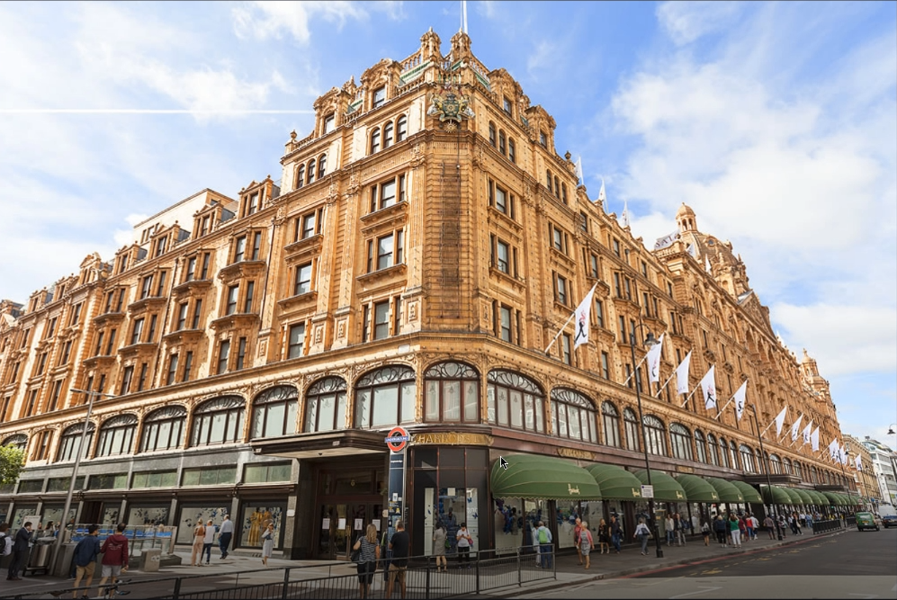
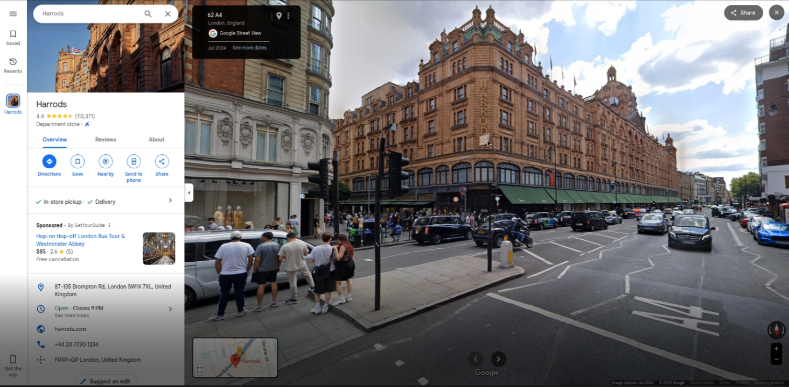
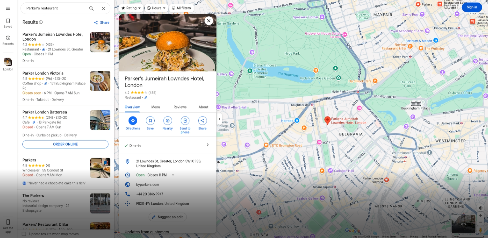

# Cafe Confidential - 75 Points

**Description:** Two photos were posted minutes apart by someone of interest. One shows them enjoying a slice of cake in a boutique cafe; the other captures a well known landmark in the backgorund. We believe both photos were taken on the same outing. Can you determine exactly which cafe they visited, and where is it?

Flag format is: C1{Cafe Name_Street Name}

For example, Tom's Cafe located at 31 Mitchell Rd. Boston, MA would be `C1{Tom's_Mitchell}`

**Supplementary Materials:** Two png files: Image_1.png and Image_2.png

**Solution:** Image_1.png initially doesn't appear to be viewable due to an incorrect format, and Image_2.png depicts an image of a building boasting British architecture.

To identify the issue with Image_1.png, we can run `exiftool` to look further into the file's metadata:

In the "File Type" field, we can see that it is actually a webp file, not a png. To fix this, there are installable linux commands to convert from webp to png, but an free online service like https://cloudconvert.com works just as well. We get this image as a result:

Here is Image_2.png for reference as well:

To find the exact locations for which these pictures depict, we can reverse image search by using Google Lens. Using Google Lens on Image_2.png (as of June 2025) tells us that it's the harrods luxury department store in london:

If we also use Google Lens on Image_1.png, we get Parker's Jumeriah Lowndes Hotel, which is a restaurant that serves the cake depicted in the image.

This cafe is *sort of* near Image_2.png, but inputting the flag as `C1{Parker's_Lowndes}` according to the flag format directions yields the correct answer.