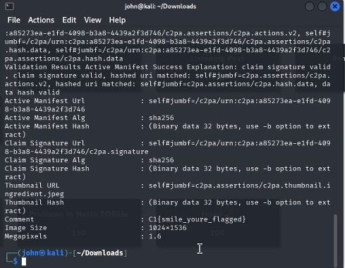

# Hidden in Plain Sight - 75 Points

**Description:** Analysts recovered a suspiscious image from a threat actor's social media account. At first glance, it looks like an innocent selfie - but insider reports suggest that a flag might be hiding in the image metadata. Can you extract it?

**Supplementary Materials:** A png file namd `selfie.png`

**Solution:** Note how in the description it hints that there is a flag hidden in the image metadata. On linux, you can use the `exiftool` command to view the metadata of a file:

In the "Comment" field, we can visibly see the correct flag: `C1{smile_youre_flagged}`