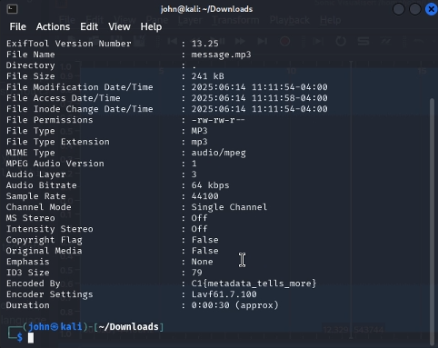

# Behind the Beat - 75 Points

**Description:** Agents intercepted an audio file named message.mp3. It plays a single tone, but we have intel that a flag might be tucked away in the metadata fields of the file. Can you inspect the file and uncover the flag?

**Supplementary Materials:** An mp3 file namd `message.mp3`

**Solution:** Note how in the description it hints that there is a flag hidden in the metadata fields of the file. On linux, you can use the `exiftool` command to view the metadata of a file:

In the "Encoded By" field, we can visibly see the correct flag: `C1{metadata_tells_more}`