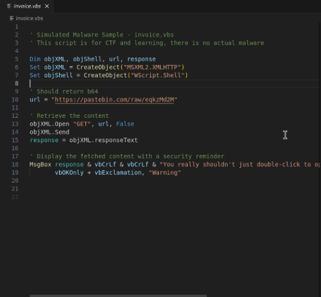
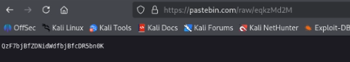
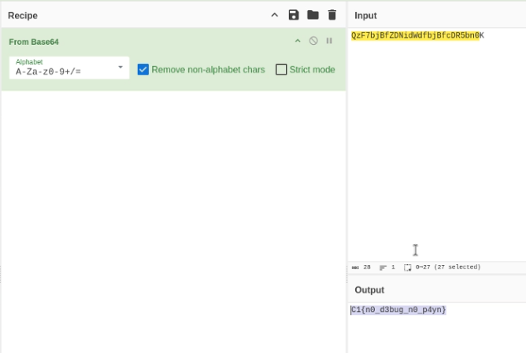

# Encoded Evidence - 75 Points

**Description:** We've intercepted a suspiscious script file. It appears to be a placeholder for some kind of malware delivery mechanism, but the actual payload seems to be hosted somewhere else. Analysts believe a flag is hidden by this script. Can you locate and decode it?

**Supplementary Materials:** A .vbs file called invoice.vbs

**Solution:** We can first view the contents of the file by using the linux command `cat invoice.vbs`, or an IDE like VSCode with `code invoice.vbs` to make it colorful :)

Within this file, there is a pastebin link, which takes us to this page containing an obfuscated string:

Using a tool like CyberChef for simple decoding, we can try different data formats until we get something legible. In this case, it was Base64: 

This gives us the correct flag: `C1{n0_d3bug_n0_p4yn}`