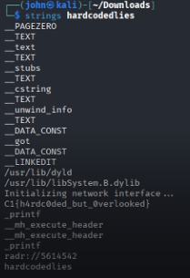

# Hardcoded Lies - 75 Points

**Description:** The malware sample doesn't appear to print anything useful. But our t hreat intel team believes it holds a hardcoded configuration string. Can you pull on some strings to retrieve it?

**Supplementary Materials:** Zip file named hardcodedlies.zip

**Solution:** Unzipping the file gives the binary called hardcodedlies. As hinted by the original description, we can use the linux `strings` command to reveal printable strings within a file, even if it's compiled:

Inside the output, we can clearly see the correct flag: `C1{h4rdc0ded_but_0verlooked}`