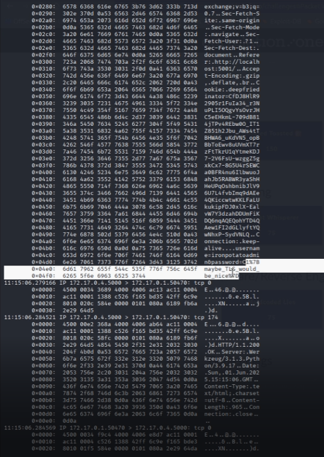

# Packet Whisperer - 75 Points

**Description:** Our blue team intercepted a network capture file. It contains unencrypted HTTP traffic. While skimming through it, analysts believe someone accidentally exposed their login credentials in plain text. Review the PCAP to find the password that the user logged in with.

**Supplementary Materials:** A .pcap file named login.pcap

**Solution:** Since this is a pcap file, we can use `tcpdump` on linux to look further into the data contained in the capture file. I ran `sudo tcpdump -qns 0 -X -r login.pcap` to reveal a lot more information that I needed to, but the minimum that you need is `-r login.pcap` to read from the file, and to include `-X` to decode in Hex and ASCII.

If we search through the ASCII, we can eventually find what looks like a flag for a password; `C1%7Bmaybe_TLS_would_be_nice%7D`
With a quick google search, %7B and %7D are the hex for '{' and '}', so fixing this would give us the correct flag: `C1{maybe_TLS_would_be_nice}`