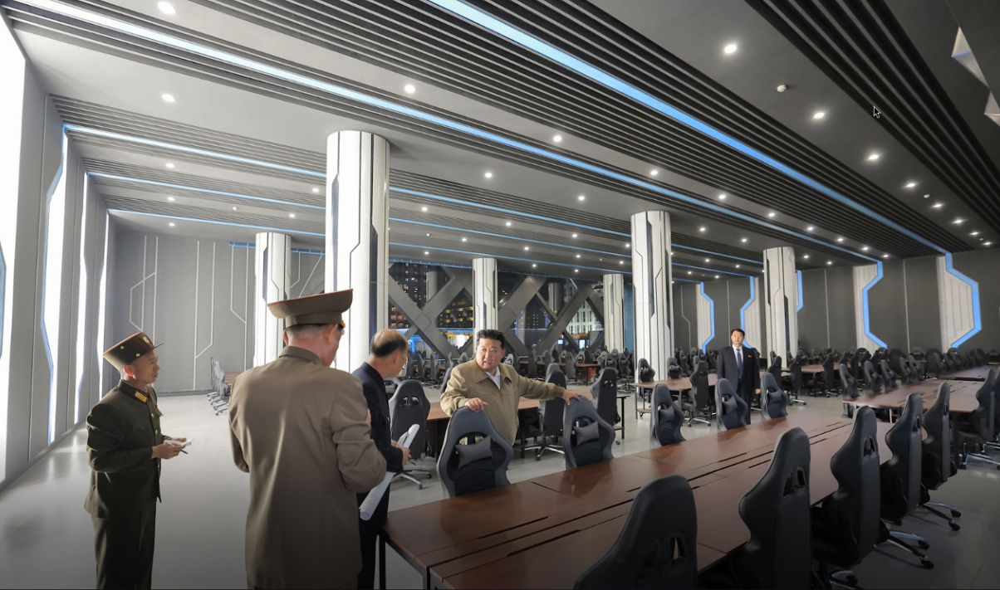
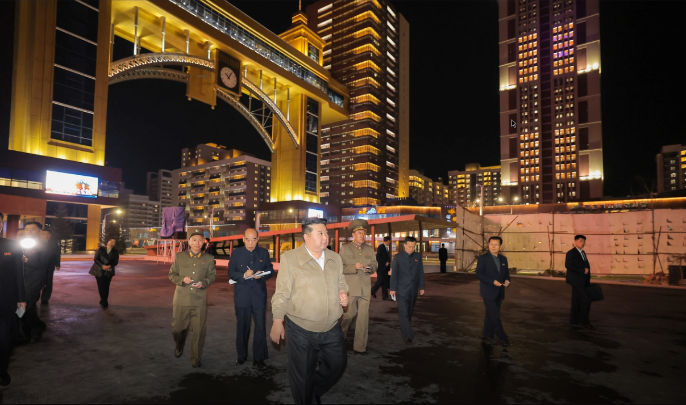
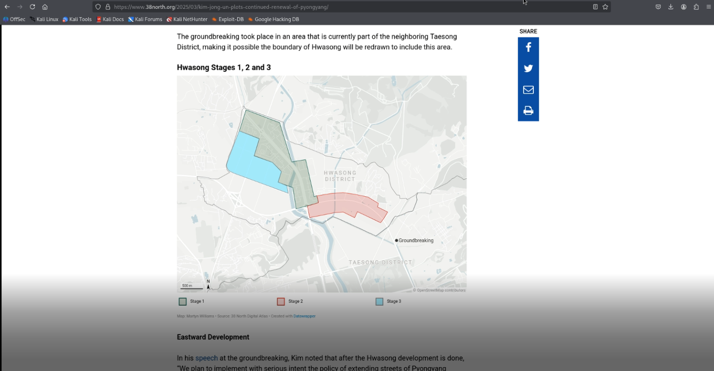
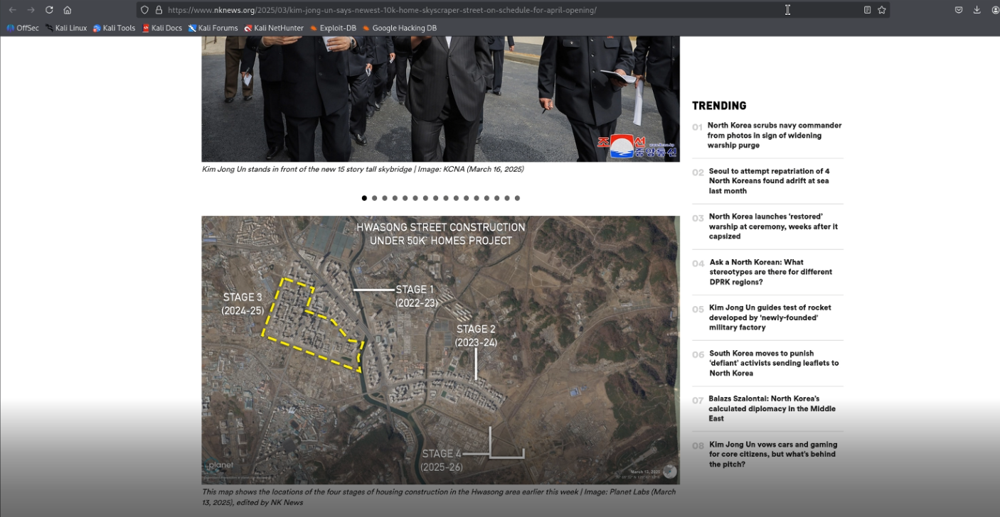
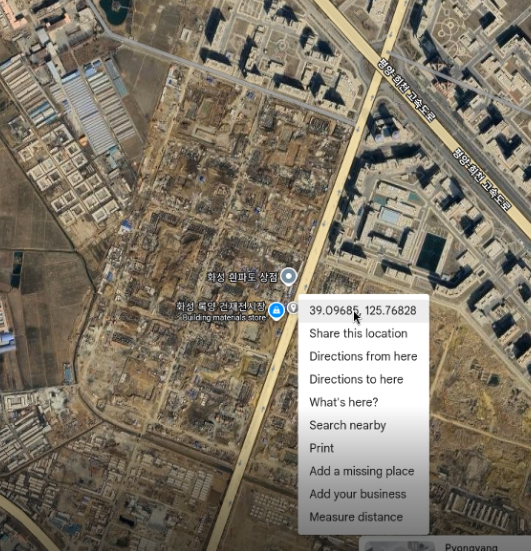

# Inspo - 200 Points

**Description:** We believe that the North Torbians are heavily influenced by North Korean developments and wish to match them. We have suspicions that Juche Jaguar will try to build out similar spaces to ones in these pictures. Can you find the coordinates of where these pictures were taken?

The flag is any valid *decimal degree coordinate notation* within a 500m radius of the building. The flag is in the following format: C1{XX.XXX, XX.XXX}

For example. the White House would be at decimal degree notion of 38.897, -77.036. The flag for the White House would be : `C1{38.897, -77.036}`

*Note that this flag is a regex match for any valid coordinate within the 500m radius*.

**Supplementary Materials:** 2 .png files: computer_club.png and walking_to_computer_club.png

**Solution:** Using a reverse image search, like Google Lens. Reverse image searching computer_club.png and walking_to_computer_club.png gives us sparse news article about recent developments within Pyongyang, North Korea. As a reference, these are the images respectively:

Mainly based from the 2nd image, there are news articles from 38north.org and nknews.org which shows the area where the developments are taking place (which is specifically in Stage 3):

From this. We can match the roads, shown in the map to the ones on Google Maps to find the general location that the picture was taken in:

The directions say to be within 500m of the picture, which is about the size of the Stage 3 location, so just by clicking center-mass and getting the corrdinates of that, then converting it to the proper format as described in the directions should yield a correct flag. In this case: `C1{39.097, 125.768}` was a correct flag.