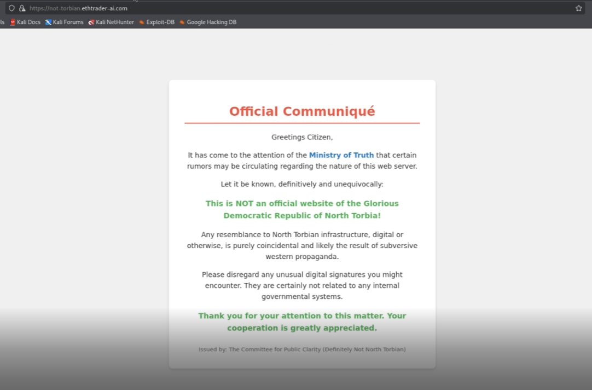
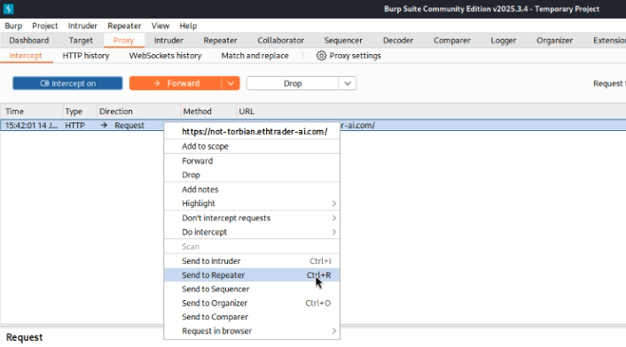

# Hoasted Toasted - 150 Points

**Description:** We have discovered what we believe is a North Torbian public website and have suspicions there is a secret internal-only site hidden there as well. Figure out how to connect to the hidden site and find the flag!

**Supplementary Materials:** A link to the website.

**Solution:** Viewing the website reveals this:

In the top left, notice the lock symbol with a caution symbol on it. Clicking that and more info reveals that it is a self-signed certificate (the issuer and the subject is the same):

Also in the "Subject Alt Names" section, there is the domain that the website is originally at, and another domain called definitelynotaflag.north.torbia.

Replacing the URL in anything but the original given URL doesn't yield in an exisiting viewable page, but the description states that it is an internal-only site, hinting that it won't be viewable by conventional means.

For this task, we can use BurpSuite to perform a Host Header Injection on the website's URL.

Start by turning Intercept to "On" in the Proxy Tab and clicking "Open browser":

Then, visit the original URL in the opened browser. Once done, an HTTP Request will appear. Right-click and send to Repeater

Now go to the Repeater tab which will look something like this:

To test specific domains, we experiment with whatever the host string is, and see if we get an example. In the above example, testing123.ethtrader-ai.com actually got a HTTP responce code of 200, indicating that it was successful. So by trying other options, like domain:website, or in this case it's definitelynotaflag.north.torbia:ethtrader-ai.com (using the alt subject name from earlier), yields us a seperate HTML response:

If we search through the HTML enough, we will find the correct flag on ln 266: `C1{vHOst_S4n_M4g1c_R3ve4l3d}`