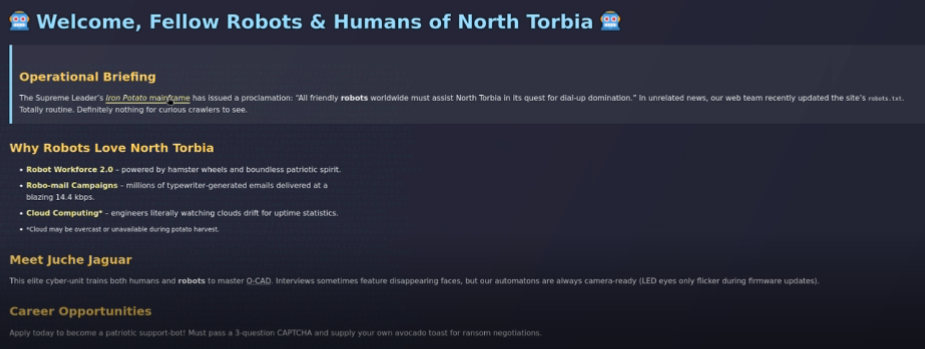
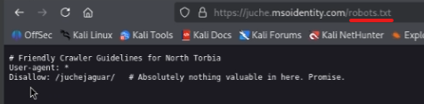
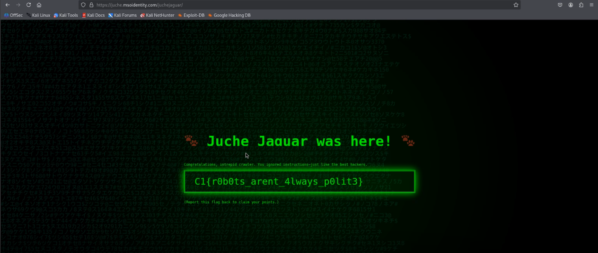

# Secret.txt Society - 75 Points

**Description:** our team suspects that a Juche Jaguar developer accidentally left somethign interesting behind on a public site. You've been tasked with examining its structure. Can you uncover what the bots were told to ignore? Start with the usual entry points a crawler might explore. One disalloweed path leads to a page where someone left behind more than just code.

**Supplementary Materials:** A URL to the website.

**Solution:** Open the website through the URL and read the *Operational Briefing* section of the website. Note how it states that the "web team recently updated the site's `robots.txt`."

With websites, you can move to different pages by altering the URL. As long as the destination exists and the user has permission, they can view it. In this case, the default URL of this page is `https://juche.msoidentity.com`. So if we add '`/robots.txt`' to the end of the link, we can view the `robots.txt` text file through our browser like so:

From this page, we can also see that `/juchejaguar/` exists as well. so replacing `/robots.txt` with `juchejaguar` will give us another page:

From here, we can visibly see the correct flag: `C1{r0b0ts_arent_4lways_p0lit3}`